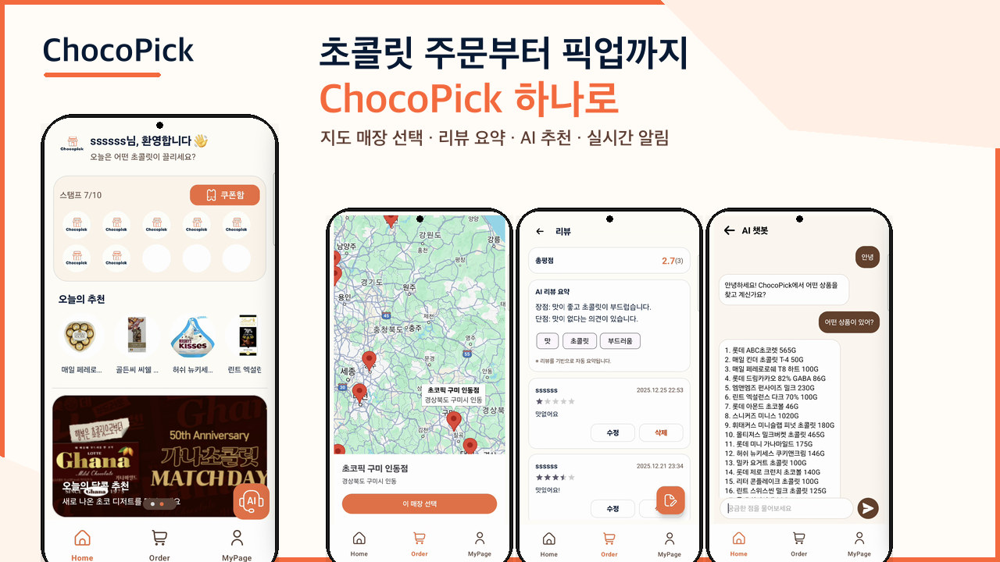
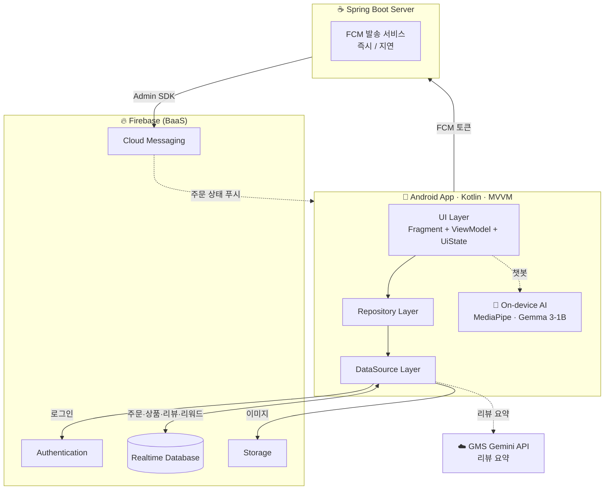

# 🍫 ChocoPick

> ### "주문은 미리, 줄은 서지 않고 — 가까운 매장에서 바로 픽업"
>
> 앱에서 초콜릿을 주문하고 지도로 고른 오프라인 매장에서 바로 받아가는 **O2O(Order-to-Offline) 스마트 픽업 서비스**.
> 네트워크 없이 기기 안에서 직접 추론하는 **온디바이스 AI 챗봇**, NFC 매장 주문, 비콘 입장 감지를 담은 안드로이드 앱입니다.

- **서비스명**: ChocoPick (Chocolate + Pick up)
- **개발 기간**: 2025.12.01 ~ 2025.12.26 (SSAFY 14기 프로젝트)
- **개발 인원**: 2명 (손다현, 이기혁)
- **핵심 특징**: 온디바이스 Gemma LLM 챗봇 · NFC/포장 주문 분기 · 비콘 입장 알림 · FCM 주문 상태 푸시



# 목차

- [프로젝트 개요](#프로젝트-개요)
- [서비스 기획 배경](#서비스-기획-배경)
- [주요 화면 및 기능 소개](#주요-화면-및-기능-소개)
- [프로젝트 핵심 기술](#프로젝트-핵심-기술)
- [시스템 아키텍처](#시스템-아키텍처)
- [Firebase 데이터 구조](#firebase-데이터-구조)
- [프로젝트 구조](#프로젝트-구조)
- [시작하기](#시작하기)
- [팀원 소개](#팀원-소개)
- [기술 스택](#기술-스택)

# 프로젝트 개요

### 📖 프로젝트 소개

**ChocoPick**은 사용자가 모바일 앱으로 초콜릿 상품을 주문한 뒤, 선택한 오프라인 매장에서 직접 픽업하는 **O2O 기반 스마트 픽업 안드로이드 서비스**입니다.

결제/정산은 MVP 범위에서 제외하고, **주문 생성 → 상태 관리 → 픽업 흐름**에 집중했습니다. 특히 서버나 네트워크에 의존하지 않고 **기기 안에서 직접 LLM을 추론하는 온디바이스 AI 챗봇**, **NFC 테이블 태깅 기반 매장 주문**, **BLE 비콘 입장 감지** 같은 모바일 디바이스 기능을 적극적으로 활용한 것이 특징입니다.

### 🎯 핵심 특징

- 🍫 **O2O 픽업** — 매장 주문(NFC 테이블 태깅) / 포장 주문(매장 200m 이상 시 경고) 두 가지 흐름
- 🤖 **온디바이스 AI** — 기기 내 **Gemma LLM** 챗봇(오프라인 동작) + AI 리뷰 요약
- 🗺️ **위치 기반 탐색** — 지도 + 리스트 동시 제공, 거리순 정렬, 위치 권한 거부 시 본사 기준 대체
- 📍 **비콘 입장 감지** — 매장 근접(BLE) 시 이용 안내 (24시간 1회)
- 🔔 **실시간 알림** — 주문 상태 변경 시 FCM 푸시, 알림 클릭 시 주문 상세로 이동
- 🎁 **리워드** — 주문 스탬프 적립, 멤버십 등급, 아메리카노 쿠폰 발행/사용

# 서비스 기획 배경

기념일이나 선물 상황에서는 빠른 구매가 중요하지만, 일반 배송은 시간 지연이 발생하고 매장을 방문하기 전에 원하는 상품의 재고를 확인하기도 어렵습니다.

**ChocoPick**은 이 문제를 **주문과 픽업을 사전에 연결**하는 방식으로 풀어냅니다.

- 🛒 **사러 가기 전에 미리 주문** — 매장에 도착하면 줄 서지 않고 바로 픽업
- 🗺️ **지도로 내 주변 매장 확인** — 어디서 받을지 먼저 고르고 주문 진행
- 🔔 **준비 상태를 푸시로 안내** — "준비 완료" 알림을 받고 방문
- 📱 **디바이스 경험 강화** — NFC 테이블 태깅, 비콘 입장 감지, 온디바이스 AI로 오프라인 매장 경험과 앱을 연결

# 주요 화면 및 기능 소개

## 🔐 회원 / 인증

<table>
  <tr>
    <th>로그인</th>
    <th>회원가입</th>
    <th>이메일 중복 확인</th>
  </tr>
  <tr>
    <td align="center"></td>
    <td align="center"></td>
    <td align="center"></td>
  </tr>
</table>

- **Firebase Authentication** 기반 아이디/비밀번호 회원가입 · 로그인, 이메일 중복 확인
- 앱 재실행 후에도 **로그인 세션 유지**, 로그아웃 제공

## 🏠 메인 홈

<table>
  <tr><td align="center"></td></tr>
</table>

- 오늘의 추천 상품, 스탬프 현황, 챗봇 진입 FAB를 한 화면에 모은 홈
- 추천 상품/스탬프 영역에서 상품 상세·리워드 화면으로 바로 이동

## 🗺️ 매장 탐색 (지도 + 리스트)

<table>
  <tr>
    <th>매장 선택</th>
    <th>지도에서 선택</th>
    <th>목록에서 선택</th>
  </tr>
  <tr>
    <td align="center"></td>
    <td align="center"></td>
    <td align="center"></td>
  </tr>
</table>

- **Google Maps SDK**로 지도와 리스트를 동시에 제공, 리스트는 **거리순 정렬**
- 매장명 검색 지원, 위치 권한 거부 시 **본사 좌표 기준**으로 대체 표시
- 매장 변경 시 장바구니는 단일 매장 기준으로 초기화

## 🛒 상품 · 장바구니

<table>
  <tr>
    <th>상품 상세</th>
    <th>수량 조정</th>
    <th>장바구니</th>
  </tr>
  <tr>
    <td align="center"></td>
    <td align="center"></td>
    <td align="center"></td>
  </tr>
</table>

- 상품 목록/상세(이름·가격·중량·제조사·원산지), 수량 조정 후 장바구니 담기
- 장바구니는 **사용자별 SharedPreferences**로 보관, 하단에 총 수량/총액 실시간 표시

## 📦 주문 — 매장(NFC) / 포장(거리 경고)

<table>
  <tr>
    <th>매장 주문 (NFC)</th>
    <th>포장 주문</th>
    <th>주문 완료 알림</th>
  </tr>
  <tr>
    <td align="center"></td>
    <td align="center"></td>
    <td align="center"></td>
  </tr>
</table>

- **STORE(매장 주문)**: 주문 시 **NFC 테이블 태깅** 필수 → 태그에서 테이블 번호 파싱 후 저장
- **TOUT(포장 주문)**: 매장과 **200m 이상** 떨어지면 경고 팝업 후 진행
- 주문 상태는 `RECEIVED → PREPARING → READY → PICKED_UP` 4단계, 주문 후 취소 불가

## ⭐ 리뷰 & AI 요약

<table>
  <tr>
    <th>리뷰 목록 (AI 요약)</th>
    <th>리뷰 작성</th>
    <th>리뷰 수정 (본인만)</th>
  </tr>
  <tr>
    <td align="center"></td>
    <td align="center"></td>
    <td align="center"></td>
  </tr>
</table>

- 별점(1~5) + 텍스트(최대 200자) 리뷰 작성/수정/삭제, **수정·삭제는 작성자 본인만**
- 상품별 리뷰 통계(평균 별점/개수) 집계, **AI가 장점/단점/키워드로 요약**

## 🤖 온디바이스 AI 챗봇

<table>
  <tr>
    <th>챗봇</th>
    <th>상품 안내</th>
    <th>매장 안내</th>
  </tr>
  <tr>
    <td align="center"></td>
    <td align="center"></td>
    <td align="center"></td>
  </tr>
</table>

- 메인 FAB 챗봇 — **기기 안에서 직접 추론하는 Gemma LLM**(네트워크 불필요)
- 매장/상품/가격 같은 정확 데이터는 규칙 기반으로 즉답, 설명/추천/응대는 LLM이 생성

## 🎁 마이페이지 · 리워드

<table>
  <tr>
    <th>마이페이지</th>
    <th>주문 내역</th>
    <th>스탬프 · 쿠폰</th>
  </tr>
  <tr>
    <td align="center"></td>
    <td align="center"></td>
    <td align="center"></td>
  </tr>
</table>

- 회원 정보 수정, 주문 내역/상세(지도 픽업 위치), 즐겨찾는 매장 관리
- 주문 누적 기반 **스탬프 적립 · 멤버십 등급 · 아메리카노 쿠폰** 발행/사용 (중복 적립 방지 포함)

## 📍 비콘 & 알림

<table>
  <tr>
    <th>비콘 입장 감지</th>
    <th>알림 설정</th>
    <th>준비 완료 알림</th>
  </tr>
  <tr>
    <td align="center"></td>
    <td align="center"></td>
    <td align="center"></td>
  </tr>
</table>

- **AltBeacon**으로 매장 근접(약 1m) 감지 시 이용 안내 (24시간 1회)
- 주문 상태가 `READY`로 바뀌면 **FCM 푸시** 수신, 알림 클릭 시 주문 상세로 이동

# 프로젝트 핵심 기술

## 🤖 온디바이스 AI 챗봇 (MediaPipe · Gemma)

- **MediaPipe Tasks GenAI** 런타임으로 **Gemma 3 (1B, int4)** 모델을 **기기 내에서 직접 추론**합니다. 서버·네트워크가 필요 없어 오프라인에서도 동작합니다.
- 앱 최초 실행 시 `ModelCopier`가 모델(`.litertlm`)을 내부 저장소로 복사하고, `LlmInference` 엔진을 초기화합니다.
- **하이브리드 응답 전략**: 매장/상품/가격 같은 *정확 데이터*는 규칙 기반(`HardcodedContext`)으로 100% 정확하게 즉답하고, *설명·추천·응대*만 LLM에 위임해 환각을 줄였습니다.

## ✨ AI 리뷰 요약 (GMS Gemini)

- 상품 리뷰를 **Gemini 2.5 Flash**(GMS API)로 요약해 **장점/단점/키워드 JSON**으로 상품 상세에 노출합니다.
- 출력 포맷을 스키마로 고정해 일관된 요약 UI를 보장합니다.

## 📲 NFC 매장 주문 & BLE 비콘

- **NFC**: 매장 주문 시 테이블의 NFC 태그를 읽어 `table:{번호}`를 파싱하고, 주문마다 테이블 번호를 저장합니다.
- **Beacon(AltBeacon)**: 매장 비콘에 근접하면 입장 알림을 띄우되, `consecutiveHits`/`cooldown`으로 오탐과 중복 노출을 제어합니다.

## 🔔 FCM 주문 상태 알림 (Spring Boot + Firebase Admin)

- 별도 **Spring Boot 서버**가 **Firebase Admin SDK**로 FCM 푸시를 발송합니다.
- 주문 흐름을 시뮬레이션하기 위해 스케줄러로 **즉시/지연(0·10·20초)** 알림("주문 완료 → 접수 → 픽업")을 순차 전송합니다.

## 🗄️ Firebase Realtime DB 기반 MVVM

- **Model → DataSource → Repository(interface) → RepositoryImpl** 계층을 일관되게 적용하고, UI는 `UiState` sealed class로 로딩/성공/에러를 통일했습니다.
- `StateFlow` + `repeatOnLifecycle`로 화면 상태를 안전하게 구독하며, 리워드 적립 등은 RTDB **트랜잭션**으로 멱등성을 보장합니다.

# 시스템 아키텍처

ChocoPick은 **Firebase를 중심 백엔드(BaaS)**로 사용합니다. 안드로이드 앱이 Realtime Database에 직접 read/write 하고, Spring 서버는 **FCM 푸시 발송 전용**으로 동작합니다.



# Firebase 데이터 구조

```
/users/{uid}                       # 회원 정보, fcmToken
/stores/{storeId}                  # 매장 (name, address, lat, lng …)
/products/{productId}              # 상품 (name, price, weight, imageUrl …)
/all_orders/{orderId}              # 전체 주문 (items, status, store, tableNo …)
/orders_eachUser/{uid}/{orderId}   # 사용자별 주문 (조회 최적화 비정규화)
/reviews/{productId}/{reviewId}    # 상품별 리뷰
/reviewStats/{productId}           # 리뷰 통계 (avgRating, reviewCount)
/rewards/{uid}                     # 스탬프, 멤버십, 쿠폰, appliedOrders(멱등성)
/coupons/{uid}/{couponId}          # 발행된 쿠폰
/favorites/{uid}/{storeId}         # 즐겨찾는 매장
/recommendProduct                  # 추천 상품 ID 목록
```

# 프로젝트 구조

```text
chocopick/
├── android/ChocoPick/              # 📱 안드로이드 앱 (Kotlin, MVVM)
│   └── app/src/main/
│       ├── java/com/ssafy/chocopick/
│       │   ├── ai/                 # 온디바이스 AI (Helper, HardcodedContext)
│       │   ├── data/
│       │   │   ├── model/          # 도메인 모델
│       │   │   ├── remote/         # Retrofit (FCM API, GMS Gemini API)
│       │   │   ├── repository/     # Repository 인터페이스 + Impl
│       │   │   └── source/         # DataSource (firebase / local / beacon / gms)
│       │   ├── ui/                 # 화면 (auth, home, order, mypage, review, chatbot, common)
│       │   └── util/               # UiState, NavExt, ModelCopier …
│       ├── assets/models/          # Gemma .litertlm 모델 (Git LFS)
│       └── res/                    # layout, drawable, menu, values …
│
├── server/chocopick/chocopick/     # ☕ Spring Boot 서버 (FCM 발송 전용)
│   └── src/main/java/.../chocopick/
│       ├── config/                 # FirebaseConfig, SchedulerConfig
│       ├── controller/             # FCMController
│       └── service/                # FCMService, DelayedFcmService
│
├── docs/                           # 📚 기획·요구사항·설계 문서 + 화면 캡처
├── product_info.json               # 초기 상품 카탈로그 (초콜릿 19종)
└── README.md
```

# 시작하기

> 🔑 `google-services.json`·Google Maps 키·GMS 키는 저장소에 포함되어 있어 별도 설정 없이 실행됩니다.

### 1. 클론 & 실행 (Android)

```bash
git clone <repository-url>
cd chocopick
git lfs pull          # 온디바이스 AI 모델(gemma3-1b, ~584MB)
```

이후 `android/ChocoPick`를 Android Studio로 열고 ▶ **Run**. (에뮬레이터 기준 추가 설정 불필요)

### 2. (선택) FCM 푸시 서버

```bash
cd server/chocopick/chocopick
# Firebase 콘솔 → 서비스 계정 키를 src/main/resources/chocopick-adminsdk.json 으로 추가
./mvnw spring-boot:run        # http://localhost:8080
```

> 앱은 서버 없이도 동작하며, 서버는 주문 상태 FCM 푸시 발송에만 사용됩니다.

# 팀원 소개

<table>
  <tr>
    <td align="center" width="160">
      <a href="https://github.com/sondahyun"><br/><b>손다현</b></a><br/>
      <sub>@sondahyun</sub>
    </td>
    <td align="center" width="160">
      <a href="https://github.com/2kihyuk"><br/><b>이기혁</b></a><br/>
      <sub>@2kihyuk</sub>
    </td>
  </tr>
</table>

# 기술 스택

## Android

<div>
  
  
  
  
  
</div>
<div>
  
  
  
  
  
</div>

## Backend / Firebase

<div>
  
  
  
  
  
</div>

## Tools

<div>
  
  
  
  
  
</div>

<br/>

<div align="center">

🍫 **ChocoPick — Order to Offline, the sweetest way to pick up.**

</div>
