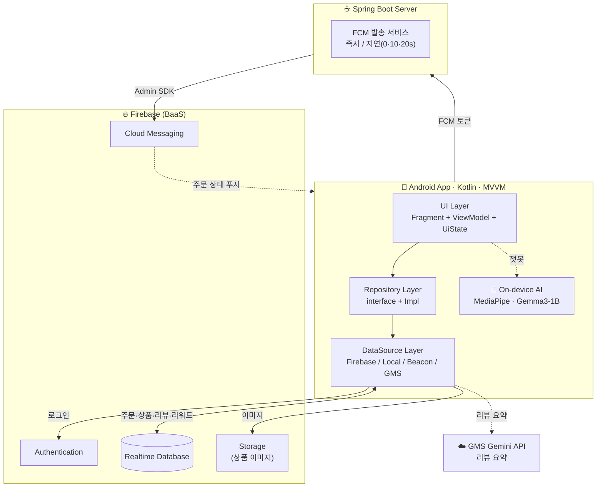

# 🍫 ChocoPick

> **주문하고, 매장에서 바로 픽업하는 O2O 초콜릿 스마트 픽업 서비스**
> 배송 대기 없이 — 앱에서 미리 주문하고 가까운 매장에서 받아가세요.

<p>
  
  
  
  
  
  
</p>

SSAFY 자율 프로젝트 · 안드로이드 기반 O2O(Order-to-Offline) 픽업 애플리케이션입니다.

---

## 📖 소개

기념일이나 선물 상황에서는 빠른 구매가 중요하지만, 일반 배송은 시간 지연이 발생하고 매장 방문 전에 원하는 상품의 재고를 확인하기 어렵습니다.

**ChocoPick**은 **주문과 픽업을 사전에 연결**하여 이 문제를 해결합니다. 사용자는 앱에서 초콜릿 상품을 주문하고, 지도로 선택한 오프라인 매장에서 직접 픽업합니다. 주문 상태는 실시간 푸시 알림으로 안내됩니다.

> ⚠️ MVP 범위상 **결제/정산 기능은 제외**되며, 주문 생성 · 상태 관리 · 픽업 흐름에 집중합니다.

---

## ✨ 주요 기능

| 분류 | 기능 |
|------|------|
| **회원** | 아이디/비밀번호 회원가입(이메일 중복 확인), 로그인 세션 유지, 로그아웃 — *Firebase Authentication* |
| **매장 탐색** | 지도 + 리스트 동시 제공, 거리순 정렬, 매장명 검색, 위치 권한 거부 시 본사 기준 표시 — *Google Maps SDK* |
| **상품 / 주문** | 상품 목록·상세, 장바구니(단일 매장 기준), 수량 조정, 총액 표시 |
| **주문 방식** | `STORE`(매장): **NFC 테이블 태깅** 필수 · `TOUT`(포장): 매장과 **200m 이상 시 경고** 후 주문 |
| **주문 상태** | `RECEIVED → PREPARING → READY → PICKED_UP` 4단계, 서버 단일 진실원천(SSOT) |
| **알림** | `READY` 전환 시 **FCM 푸시**, 알림 클릭 시 주문 상세로 이동 |
| **리뷰** | 별점(1~5) + 텍스트(최대 200자) 작성/수정/삭제 (본인만), 상품별 리뷰 통계 |
| **리워드** | 주문 스탬프 적립, 멤버십 등급(BRONZE/SILVER/GOLD), 아메리카노 쿠폰 발행/사용 |
| **즐겨찾기** | 매장 즐겨찾기 추가/관리 |
| **🤖 온디바이스 AI 챗봇** | 메인 FAB 챗봇 — 매장/상품/가격 안내(rule-based) + 설명/추천(*MediaPipe Gemma 로컬 추론*) |
| **🤖 AI 리뷰 요약** | 상품 리뷰를 장점/단점/키워드로 요약 (*GMS Gemini API*) |
| **📍 Beacon 알림** | 매장 근접(BLE) 감지 시 이용 안내 (24시간 1회) — *AltBeacon* |

전체 기능 요구사항(F01~F27)은 [`docs/01_requirements/requirements.md`](docs/01_requirements/requirements.md)에 정의되어 있습니다.

---

## 🖼️ 스크린샷

| 로그인 | 메인 (추천·스탬프) | 매장 선택 (지도) |
|:---:|:---:|:---:|
|  |  |  |
| **상품 상세 · 리뷰** | **장바구니 · 주문** | **AI 챗봇** |
|  |  |  |

> 전체 화면 캡처는 [`docs/화면 캡쳐/`](docs/화면%20캡쳐) 폴더에서 확인할 수 있습니다.

---

## 🛠️ 기술 스택

### Client (Android)
- **Kotlin** 2.0.21 · **MVVM** · ViewBinding
- **Coroutines / Flow** (`StateFlow` + `repeatOnLifecycle`)
- **Retrofit2** + Gson (서버 FCM API, GMS Gemini API)
- **Firebase** Auth · Realtime Database · Cloud Messaging · Storage (BOM 34.7.0)
- **Google Maps SDK** + Play Services Location
- **MediaPipe Tasks GenAI** 0.10.27 (온디바이스 LLM 추론)
- **AltBeacon** (BLE 비콘) · **Glide** (이미지 로딩)
- minSdk 24 · targetSdk 36 · JDK 11 · AGP 8.11.1 · Gradle 8.13

### Server
- **Spring Boot** 3.5.x · Spring Web · JDK 17 · Maven
- **Firebase Admin SDK** 9.2.0 (FCM 발송)
- Spring Scheduling (지연 푸시 알림)

### Infra / Backend-as-a-Service
- **Firebase Realtime Database** — 실질적 데이터 저장소 (앱이 직접 read/write)
- **Firebase Cloud Messaging** — 주문 상태 푸시

---

## 🏗️ 아키텍처

ChocoPick은 **Firebase를 중심 백엔드**로 사용합니다. 안드로이드 앱이 Realtime Database에 직접 read/write 하며, Spring 서버는 **FCM 푸시 발송 전용**으로 동작합니다(주문 데이터를 다루지 않음).



**계층 구조**
```
UI (Fragment + ViewModel)  →  UiState(sealed)로 Loading/Success/Error 통일
   └─ Repository (interface)
        └─ RepositoryImpl
             └─ DataSource (Firebase Realtime / Local / Beacon / GMS)
DI: ServiceLocator + ViewModelFactory (수동 주입)
```

---

## 📂 프로젝트 구조

```
chocopick/
├── android/ChocoPick/              # 📱 안드로이드 앱 (Kotlin, 152개 .kt)
│   └── app/src/main/
│       ├── java/com/ssafy/chocopick/
│       │   ├── ai/                 # 온디바이스 AI (Helper, HardcodedContext)
│       │   ├── data/
│       │   │   ├── model/          # 도메인 모델 (Order, Product, Review, Reward …)
│       │   │   ├── remote/         # Retrofit (FCM API, GMS Gemini API)
│       │   │   ├── repository/     # Repository 인터페이스 + Impl
│       │   │   └── source/         # DataSource (firebase / local / beacon / gms)
│       │   ├── ui/                 # 화면 (auth, home, order, mypage, review, chatbot, common)
│       │   └── util/               # UiState, NavExt, ModelCopier, DistanceUtil …
│       ├── assets/models/          # Gemma .litertlm 모델 (Git LFS)
│       └── res/                    # layout(31), drawable, menu, values …
│
├── server/chocopick/chocopick/     # ☕ Spring Boot 서버 (FCM 발송 전용)
│   └── src/main/java/com/ssafy/chocopick/chocopick/
│       ├── config/                 # FirebaseConfig, SchedulerConfig
│       ├── controller/             # FCMController (/api/test/fcm …)
│       └── service/                # FCMService, DelayedFcmService
│
├── docs/                           # 📚 기획·요구사항·설계·API 문서 + 화면 캡처
├── img/                            # 상품 이미지 (750×750)
├── product_info.json               # 초기 상품 카탈로그 (초콜릿 19종)
└── README.md
```

---

## 🚀 시작하기

> 🔑 Firebase 설정(`google-services.json`), Google Maps 키, GMS API 키는 **모두 저장소에 포함**되어 있어
> 별도 키 설정 없이 클론 후 바로 실행됩니다.

### 사전 요구사항
- **Android Studio** (Koala 이상 권장), **JDK 11+**
- **Git LFS** (AI 모델 파일 — 필수)
- **JDK 17** + Maven (FCM 서버를 함께 띄울 때만)

### 1. 클론 & 실행

```bash
git clone <repository-url>
cd chocopick
git lfs pull          # 온디바이스 AI 모델(gemma3-1b, ~584MB) 내려받기
```

이후 `android/ChocoPick` 를 Android Studio로 열고 ▶ **Run** 하면 끝입니다.
에뮬레이터 기준 추가 설정이 필요 없습니다. (실기기에서 FCM까지 테스트하려면 `data/remote/ApiProvider.kt`의 `BASE_URL`만 PC의 LAN IP로 변경 — 에뮬레이터는 기본값 `10.0.2.2`로 동작)

> 챗봇은 `gemma3-1b-it-int4.litertlm` 단일 파일만 사용하며, 앱 최초 실행 시 `ModelCopier`가 내부 저장소로 복사합니다.
> `gemma-3n-E2B`(분할본)는 **선택** — 더 큰 모델로 교체할 때만 아래처럼 재조립합니다:
> ```bash
> cd android/ChocoPick/app/src/main/assets/models
> cat gemma-3n-E2B-it-int4.litertlm.part-aa gemma-3n-E2B-it-int4.litertlm.part-ab > gemma-3n-E2B-it-int4.litertlm
> ```

### 2. (선택) FCM 푸시 서버

주문 상태 푸시 알림을 테스트하려면 Spring 서버를 띄웁니다. **앱 자체는 서버 없이도 동작**합니다(푸시만 미발생).

```bash
cd server/chocopick/chocopick

# Firebase 콘솔 → 프로젝트 설정 → 서비스 계정 → 새 비공개 키 생성 후 아래 경로에 저장
#   src/main/resources/chocopick-adminsdk.json   ← 저장소에 없는 유일한 파일, 한 번만 추가
./mvnw spring-boot:run        # http://localhost:8080
```

푸시 발송 테스트:
```bash
curl -X POST "http://localhost:8080/api/test/fcm/delayed" \
  -H "Content-Type: application/json" \
  -d '{"token":"<FCM_TOKEN>","title":"주문완료","body":"테스트"}'
```
`/api/test/fcm/delayed`는 주문 흐름을 시뮬레이션하여 0초/10초/20초 간격으로 "주문 완료 → 접수 → 픽업" 푸시를 발송합니다.

---

## 🗄️ Firebase Realtime Database 구조

```
/users/{uid}                       # 회원 정보, fcmToken
/stores/{storeId}                  # 매장 (name, address, lat, lng, nfcRequired …)
/products/{productId}              # 상품 (name, price, weight, manufacturer, imageUrl …)
/all_orders/{orderId}              # 전체 주문 (items, status, store, totalPrice, tableNo …)
/orders_eachUser/{uid}/{orderId}   # 사용자별 주문 (조회 최적화를 위한 비정규화)
/reviews/{productId}/{reviewId}    # 상품별 리뷰 (rating, content, uid …)
/reviewStats/{productId}           # 리뷰 통계 (avgRating, reviewCount, ratingSum)
/rewards/{uid}                     # 스탬프, 멤버십 등급, 쿠폰, appliedOrders(멱등성)
/coupons/{uid}/{couponId}          # 발행된 쿠폰
/favorites/{uid}/{storeId}         # 즐겨찾는 매장 (boolean)
/recommendProduct                  # 추천 상품 ID 목록
```

초기 상품 데이터는 [`product_info.json`](product_info.json) (초콜릿 19종)을 참고하세요.

---

## 🤖 온디바이스 AI

ChocoPick의 챗봇은 **기기 내에서 직접 LLM을 추론**합니다(네트워크/서버 불필요).

- **모델**: Google **Gemma 3 (1B, int4 양자화)** — `.litertlm` 포맷, MediaPipe Tasks GenAI 런타임
- **하이브리드 응답**:
  - 매장·상품·가격 등 **정확 데이터**는 rule-based로 즉시 응답 (`HardcodedContext`)
  - 그 외 **설명·추천·응대**만 로컬 LLM 호출 (`Helper.chat()`)
- **리뷰 요약**은 온디바이스가 아닌 **원격 GMS Gemini API**(`gemini-2.5-flash`)를 사용해 장점/단점/키워드 JSON으로 생성

자세한 모델 배포 방식은 [`assets/models/README.md`](android/ChocoPick/app/src/main/assets/models/README.md) 참고.

---

## 📋 핵심 정책

- **장바구니**는 단일 매장 기준 — 매장 변경 시 비워집니다.
- **주문 취소 불가** — 주문 생성 이후에는 취소할 수 없습니다.
- **STORE 주문**은 NFC 테이블 태깅(`table:{번호}`) 성공 시에만 생성됩니다.
- **TOUT 주문**은 매장과 200m 이상 떨어진 경우 경고 후 진행합니다.
- **픽업 예정 시각**은 기본 "현재 +30분"(테스트 모드 +30초).
- **리뷰**는 작성자 본인만 수정/삭제 가능(서버 검증).

---

## 📚 문서

| 문서 | 내용 |
|------|------|
| [기획 요약](docs/00_overview/planning-summary.md) | 서비스 개요·배경·핵심 가치 |
| [기술 스택](docs/00_overview/tech-stack.md) | 사용 기술 정리 |
| [요구사항 분석서](docs/01_requirements/requirements.md) | 기능(F01~F27)·비기능 요구사항, 정책 |
| [사용자 흐름](docs/01_requirements/user-flow.md) | 주요 사용자 시나리오 |
| [정보 구조 / 데이터 모델](docs/02_design/data-model.md) | IA, 데이터 모델 |
| [API 명세](docs/03_api/api-spec.md) | REST API 초안 |
| [의사결정 기록](docs/04_meeting/decisions.md) | 주요 결정 사항 |

---

## 👥 팀

**SSAFY** 자율 프로젝트 — `com.ssafy.chocopick`

---

<sub>🍫 ChocoPick — Order to Offline, the sweetest way to pick up.</sub>
